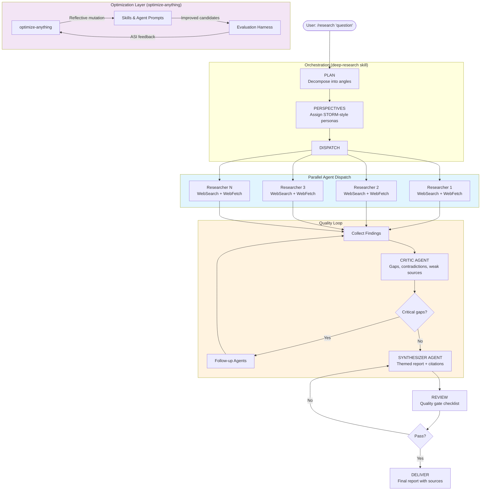
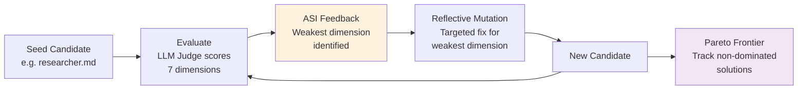
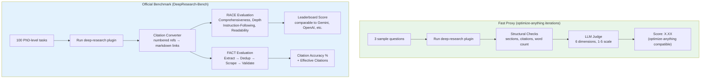

# deep-research

A Claude Code plugin that turns any session into a SOTA deep research engine. Multi-agent, multi-perspective, citation-verified research with adaptive depth control, contradiction detection, and iterative prompt optimization via test-time compute.

Say `/research "your question"` and get a publication-quality report backed by sources.

## Theoretical Foundation: Test-Time Reasoning & Iterative Refinement

This project is grounded in the emerging paradigm of **test-time compute scaling** — the idea that allocating more inference-time reasoning (rather than just pre-training compute) dramatically improves output quality. Specifically:

**Agentic RAG as test-time reasoning.** Traditional RAG does a single retrieval pass. Deep research systems like this one perform *iterative* retrieval — planning queries, evaluating results, detecting gaps, and searching again. Each iteration is a "reasoning step" at inference time. The adaptive-depth skill implements a **retrieval trigger classifier** that decides when more compute (more searches) will yield diminishing returns — directly inspired by [DeepResearcher](https://arxiv.org/abs/2504.03160)'s end-to-end RL approach to learning when to search.

**Multi-agent debate as inference-time verification.** The researcher → critic → follow-up → synthesizer pipeline implements a form of **self-consistency checking** at test time. The critic agent acts as a verifier (analogous to reward models in RLHF), identifying low-confidence claims that need more evidence. This mirrors how OpenAI's o3 and DeepSeek-R1 use chain-of-thought verification to catch errors before committing to answers.

**STORM-style perspective sampling.** Generating multiple researcher personas and dispatching them in parallel is a test-time technique for **covering the output distribution** — similar to Best-of-N sampling but applied to research angles rather than token sequences. Each perspective explores a different region of the information space, and the synthesizer merges them.

**Iterative prompt optimization via optimize-anything.** Every text artifact in this system (agent prompts, skills, report templates) is treated as a candidate in an optimization loop. Using the [optimize-anything](https://github.com/anthropics/claude-plugins-official) skill, we run reflective mutation with ASI (Actionable Side Information) feedback — essentially **learned test-time strategies** that improve the system's prompts based on evaluation diagnostics. This is the "training" phase of test-time compute: the prompts themselves are optimized through inference.

## Architecture



## Installation

```bash
# From the Claude Code plugin marketplace
claude plugins install deep-research

# Or from git
claude plugins install --url https://github.com/rachittshah/deep-research.git
```

## Usage

### Commands

| Command | Description |
|---------|-------------|
| `/research "question"` | Run the full research pipeline |
| `/research-plan "question"` | Generate a research plan for review (without executing) |
| `/research-review` | Review and verify the most recent research report |

### Configuration Presets

Specify a preset in your request: "do a quick/standard/thorough research on..."

| Preset | Angles | Perspectives | Critic | Follow-up | Best for |
|--------|--------|-------------|--------|-----------|----------|
| **quick** | 2-3 | 2 | skip | skip | Simple factual questions |
| **standard** | 3-5 | 3 | yes | 1 round | Most research (default) |
| **thorough** | 5-7 | 4-5 | yes | up to 2 | Complex or high-stakes topics |

## What Makes This Different

**Multi-perspective research** — Based on Stanford STORM: generates distinct researcher personas (academic, practitioner, skeptic, etc.) to prevent single-viewpoint tunnel vision.

**Adaptive depth control** — Agents detect diminishing returns and stop when searches repeat. Complexity classification routes questions to the right depth level.

**Contradiction detection** — Actively searches for both supporting AND contradicting evidence. Conflicts are surfaced in the report, never silently resolved.

**Source credibility scoring** — Every source gets evaluated: type (academic, news, government), recency, cross-reference count. Claims get confidence levels (verified, likely, unverified, contradicted).

**Citation verification** — Every factual claim requires an inline citation `[n]` mapping to the sources appendix. Unsourced claims are flagged `[UNSOURCED]`. The review phase catches gaps.

**Critic agent** — A dedicated agent reviews all findings before synthesis, identifying gaps, contradictions, and weak sources. Critical gaps trigger targeted follow-up research.

## Optimizing with optimize-anything

Every text artifact in this system — agent prompts, skills, templates — can be iteratively improved using the **optimize-anything** skill. This implements a GEPA (Generate, Evaluate, Propose, Apply) loop with Pareto frontier tracking.

### How It Works



### Optimizing Agent Prompts

Each agent prompt is a candidate with specific scoring dimensions:

| Artifact | Candidate | Evaluator Dimensions | Objective |
|----------|-----------|---------------------|-----------|
| `agents/researcher.md` | Researcher prompt text | Specificity, Source Attribution, Query Strategy, Diminishing Returns, Contradiction Handling, Structured Output, Conciseness | Max finding quality + citation coverage |
| `agents/critic.md` | Critic prompt text | Gap Detection, Contradiction Detection, Source Audit, Prioritization, Actionability, False Positive Rate, Conciseness | Max useful gaps found, min noise |
| `agents/synthesizer.md` | Synthesizer prompt text | Thematic Organization, Citation Rigor, Contradiction Presentation, Perspective Balance, Writing Quality, Report Completeness, Limitation Honesty, Conciseness | Max report quality |
| `skills/deep-research/SKILL.md` | Orchestration skill | Pipeline Clarity, Parallel Dispatch, Plan Quality, Critique Integration, Preset Differentiation, Red Flag Coverage, Skill Composability, Compliance Enforcement | Max pipeline adherence |

### Running Optimization

```bash
# In a Claude Code session with optimize-anything skill installed:

# Optimize the researcher agent prompt
"Optimize agents/researcher.md using optimize-anything.
 Candidate: the researcher prompt.
 Evaluator: LLM judge scoring Specificity, Source Attribution, Query Strategy,
            Diminishing Returns, Contradiction Handling, Structured Output, Conciseness (each 1-10).
 Objective: Maximize research finding quality while keeping prompt under 800 words.
 Run 7 iterations of reflective mutation."

# Optimize the orchestration skill
"Optimize skills/deep-research/SKILL.md using optimize-anything.
 Evaluator: LLM judge scoring Pipeline Clarity, Parallel Dispatch, Plan Quality,
            Critique Integration, Compliance Enforcement (each 1-10).
 Objective: Maximize agent compliance with the 8-phase pipeline.
 Run 7 iterations."
```

### Optimization with Benchmark Feedback

For the strongest optimization, use DeepResearch-Bench scores as the evaluator:

```bash
# optimize-anything with shell evaluator pointing to our harness
seed_candidate: {"skill": "<contents of skills/deep-research/SKILL.md>"}
evaluator:
  type: shell
  command: "./tests/run-eval.sh --candidate-file {{candidate_file}} --candidate-target skills/deep-research/SKILL.md --quick"
  score_pattern: "Score: ([\\d.]+)"
objective: "Maximize research report quality across completeness, accuracy, citations, balance, coherence, and source credibility"
config:
  max_iterations: 15
```

This creates a feedback loop: optimize-anything proposes a modified skill → the harness runs the plugin with that skill on 3 benchmark questions → scores them → feeds ASI back to optimize-anything → targeted improvements → repeat.

### Pareto Frontier

optimize-anything tracks a **Pareto frontier** of non-dominated solutions across multiple objectives. For example, when optimizing the researcher prompt, it might find:
- Candidate A: highest specificity but verbose (780 words)
- Candidate B: most concise (450 words) but lower source attribution
- Candidate C: best balance across all dimensions

All three are kept on the frontier. The final selection depends on which trade-off you prefer.

## Running Benchmarks

### Two Evaluation Layers



| Layer | Script | Purpose | Cost | Time |
|-------|--------|---------|------|------|
| **Proxy** | `tests/run-eval.sh --quick` | Fast iteration for optimize-anything | ~$1-2 | ~5 min |
| **Official** | `tests/deepresearch-bench/run-bench.sh` | Leaderboard-comparable RACE+FACT scores | ~$50-100 | ~2-4 hrs |

### Quick Proxy Evaluation

```bash
# Score a single report
./tests/run-eval.sh --report path/to/report.md --question "Your research question"

# Run on 3 DeepResearch-Bench tasks (fast proxy)
./tests/run-eval.sh --quick

# Run with candidate swap (for optimize-anything)
./tests/run-eval.sh \
  --candidate-file modified-skill.md \
  --candidate-target skills/deep-research/SKILL.md \
  --quick
```

**Proxy scoring dimensions** (each 1-5, weighted):

| Dimension | Weight | What it measures |
|-----------|--------|-----------------|
| Completeness | 0.20 | All angles addressed, no major gaps |
| Accuracy | 0.20 | Claims correct and verifiable |
| Citation Quality | 0.20 | Every claim cited with real URLs |
| Balance | 0.15 | Multiple perspectives, contradictions surfaced |
| Coherence | 0.15 | Thematic organization, logical flow |
| Source Credibility | 0.10 | Authoritative, recent, appropriate sources |

### Official DeepResearch-Bench Evaluation

[DeepResearch-Bench](https://deepresearch-bench.github.io/) is a benchmark of 100 PhD-level research tasks across 22 domains, scored by RACE (report quality) and FACT (citation accuracy) frameworks.

```bash
# 1. Clone the benchmark
git clone https://github.com/Ayanami0730/deep_research_bench /tmp/deep_research_bench

# 2. Run our plugin on their tasks
./tests/deepresearch-bench/adapter.sh \
  --bench-dir /tmp/deep_research_bench \
  --model opus \
  --lang en \
  --concurrent 3

# 3. Run official RACE + FACT evaluation
export GEMINI_API_KEY="your-key"   # Gemini 2.5 Pro judges RACE
export JINA_API_KEY="your-key"     # Jina scrapes cited URLs for FACT
./tests/deepresearch-bench/run-bench.sh \
  --bench-dir /tmp/deep_research_bench \
  --model-name our-plugin

# 4. View results
cat tests/deepresearch-bench/results/race_result.txt
cat tests/deepresearch-bench/results/fact_result.txt
```

**RACE dimensions**: Comprehensiveness, Depth, Instruction-Following, Readability (scored 0-10, normalized against Gemini reference reports; 50 = parity)

**FACT metrics**: Citation Accuracy (% of citations that are verifiable), Effective Citations (average verified citations per task)

### A/B Comparison

```bash
# Compare two runs (e.g., before vs after optimization)
./tests/compare-runs.sh \
  --baseline tests/runs/20260308-120000 \
  --candidate tests/runs/20260308-150000
```

### Current Leaderboard Context

| System | RACE Overall | C. Acc. | E. Cit. |
|--------|-------------|---------|---------|
| Xiaoyi DeepResearch | 55.13 | — | — |
| Gemini 2.5 Pro DR | 48.88 | 81.4% | 111.2 |
| OpenAI Deep Research | 46.98 | 78.0% | 40.8 |
| Claude Researcher | 45.00 | — | — |
| Perplexity DR | 40.24 | 90.2% | 31.3 |
| Claude-3.7-Sonnet+Search | 42.18 | 87.3% | 28.1 |

*Our target: beat Claude-3.7-Sonnet baseline (42.18) and approach top-5 (45+)*

## Skills Reference

| Skill | Purpose |
|-------|---------|
| `deep-research` | Primary orchestration — the full 8-phase pipeline |
| `research-planning` | Decompose questions into structured research angles |
| `multi-perspective` | Generate researcher personas for balanced coverage |
| `adaptive-depth` | Decide when to go deeper, broaden, or stop |
| `source-evaluation` | Credibility scoring framework for sources |
| `contradiction-detection` | Cross-source conflict identification and resolution |
| `citation-tracking` | Inline citations and provenance tracking |
| `research-synthesis` | Multi-source synthesis methodology |
| `research-review` | Final quality gate before delivery |

## Agents Reference

| Agent | Role | Spawned by |
|-------|------|------------|
| `researcher` | Investigates a single angle with WebSearch/WebFetch, returns structured findings | Orchestrator (parallel, one per angle) |
| `critic` | Evaluates combined findings for gaps, contradictions, source quality issues | Orchestrator (after researchers complete) |
| `synthesizer` | Produces the final report with citations from all findings | Orchestrator (after critique) |

## Project Structure

```
deep-research/
├── .claude-plugin/              Plugin metadata
├── hooks/                       SessionStart capability injection
├── skills/                      9 methodology skills
│   ├── deep-research/           Primary orchestration (8-phase pipeline)
│   ├── research-planning/       Question decomposition
│   ├── multi-perspective/       STORM-style perspectives
│   ├── adaptive-depth/          Depth/breadth/stop decisions
│   ├── source-evaluation/       Credibility scoring
│   ├── contradiction-detection/ Cross-source conflict resolution
│   ├── citation-tracking/       Provenance tracking
│   ├── research-synthesis/      Report generation methodology
│   └── research-review/         Quality gate
├── agents/                      3 optimized subagent prompts
│   ├── researcher.md            Parallel research agent
│   ├── critic.md                Gap/contradiction finder
│   └── synthesizer.md           Report writer
├── commands/                    Slash commands
│   ├── research.md              /research
│   ├── research-plan.md         /research-plan
│   └── research-review.md       /research-review
├── templates/                   Report and source-card templates
└── tests/                       Evaluation harness
    ├── run-eval.sh              Fast proxy evaluator (optimize-anything compatible)
    ├── judge-rubric.md          LLM judge prompt with 6-dimension rubrics
    ├── structural-checks.sh     Deterministic section/citation checks
    ├── run-judge.sh             Standalone LLM judge runner
    ├── compare-runs.sh          A/B comparison tool
    └── deepresearch-bench/      Official benchmark integration
        ├── adapter.sh           Runs plugin on 100 bench tasks
        ├── run-bench.sh         RACE + FACT evaluation pipeline
        └── extract-questions.sh Task summary utility
```

## Requirements

- Claude Code CLI with plugin support
- For proxy eval: no additional dependencies
- For official benchmark: Gemini API key (RACE judge), Jina API key (FACT scraping)

## License

MIT
