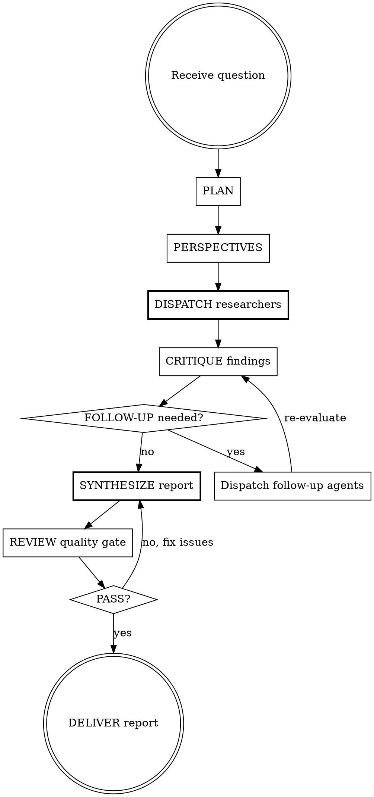

# Deep Research

Multi-agent, multi-perspective, citation-verified research engine. Orchestrates the full pipeline: plan, dispatch, critique, synthesize, review.

<EXTREMELY-IMPORTANT>
Follow this workflow exactly. Do not skip phases. Do not combine phases. Do not shortcut the pipeline.

HARD RULES — violating any of these produces a failed research report:
1. Every phase must complete before the next begins (except parallel dispatch within Phase 3)
2. ALL researcher agents MUST be dispatched in a SINGLE response — never sequentially
3. Every factual claim in the final report MUST have an inline citation
4. The critic phase is NEVER skipped for standard or thorough presets
5. The review checklist runs on EVERY report, including quick preset
6. If the critic says "targeted_followup," you MUST dispatch follow-up agents — no rationalizing
</EXTREMELY-IMPORTANT>

## Quick Reference

```
PLAN → PERSPECTIVES → DISPATCH (parallel) → CRITIQUE → [FOLLOW-UP → re-CRITIQUE] → SYNTHESIZE → REVIEW → DELIVER
```



## Configuration Presets

| Preset | Angles | Perspectives | Critic | Follow-up rounds | Review | Use when |
|--------|--------|-------------|--------|-----------------|--------|----------|
| **quick** | 2-3 | 2 | skip | 0 | abbreviated | Simple factual questions, time-sensitive requests |
| **standard** | 3-5 | 3 | full | up to 1 | full | Most research questions (**default**) |
| **thorough** | 5-7 | 4-5 | full | up to 2 | full + re-verify | Complex, high-stakes, or controversial topics |

Default to **standard** unless the user specifies otherwise or the question clearly warrants quick/thorough.

### Per-Phase Preset Behavior

| Phase | quick | standard | thorough |
|-------|-------|----------|----------|
| PLAN | Lightweight: classify + 2-3 angles, skip dependency mapping | Full planning with dependencies | Full planning + expected contradictions + resolution strategies |
| PERSPECTIVES | 2 personas, no challenge perspective | 3 personas, primary + challenge per angle | 4-5 personas, primary + challenge + wildcard per high-controversy angle |
| DISPATCH | 2-3 agents, atomic/moderate complexity only | 3-5 agents, mixed complexity | 5-7 agents, allow deep complexity |
| CRITIQUE | Skip entirely — go straight to synthesize | Full critic agent spawn | Full critic + explicitly check for perspective balance |
| FOLLOW-UP | None | 1 round max, only CRITICAL issues | 2 rounds max, CRITICAL + high-value IMPORTANT issues |
| SYNTHESIZE | Concise report, shorter analysis section | Full report structure | Full report + extended analysis + detailed methodology |
| REVIEW | Abbreviated: citation check + question-answered check only | Full 11-item checklist | Full checklist + citation re-verification against sources |
| DELIVER | Present report | Present report + offer follow-up | Present report + offer follow-up + suggest related questions |

## Skills Reference

This skill draws on methodologies from other skills. Here is how each is used:

| Skill | How used | When referenced |
|-------|----------|-----------------|
| **research-planning** | Methodology is applied directly in Phase 1 (do NOT invoke via Skill tool) | Angle decomposition, dependency mapping, controversy identification |
| **multi-perspective** | Methodology is applied directly in Phase 2 (do NOT invoke via Skill tool) | Persona generation, perspective assignment |
| **adaptive-depth** | Applied as decision framework in Phase 4 to evaluate sufficiency | Diminishing returns detection, depth vs breadth decisions |
| **citation-tracking** | Rules enforced by synthesizer agent and verified in Phase 7 | Inline citations, orphan detection, provenance chain |
| **source-evaluation** | Applied by researcher agents during search | Credibility scoring, source type classification |
| **research-review** | Checklist applied directly in Phase 7 (do NOT invoke via Skill tool) | Quality gate before delivery |
| **contradiction-detection** | Applied by critic agent during Phase 4 | Finding conflicts between sources |
| **research-synthesis** | Methodology embedded in synthesizer agent prompt | Theme-based organization, evidence weighting |

**Rule: Never invoke these skills via the Skill tool. Their methodologies are already embedded in the agent prompts and this orchestration. Invoking them would create redundant work.**

## The Pipeline

### Phase 1: PLAN

Apply the research-planning methodology directly:

1. **Classify** the question type: factual, analytical, comparative, exploratory, or predictive
2. **Decompose** into research angles (count per preset):
   - Each angle must be a **specific, answerable sub-question** — not a vague topic
   - GOOD: "What is the current market size and 5-year CAGR for [industry]?"
   - BAD: "Look into the economic aspects"
   - GOOD: "What regulatory changes since 2023 affect [topic] in the EU?"
   - BAD: "Research regulations"
3. For each angle, determine:
   - The specific sub-question (must be falsifiable or quantifiable)
   - Expected source types (academic, news, government, industry, technical)
   - Complexity estimate (atomic = 1-2 searches, moderate = 3-5, deep = 6-8)
   - Whether web search is required (almost always yes)
4. **Map dependencies** between angles (skip for quick preset)
   - Independent angles dispatch in parallel
   - Dependent angles require sequential batching
5. **Flag controversy areas** — where sources are likely to disagree (skip for quick preset)

**Angle Quality Check** — before proceeding, verify each angle:
- [ ] Is it specific enough that a researcher could start searching immediately?
- [ ] Does it have clear success criteria (what constitutes a sufficient answer)?
- [ ] Is it non-overlapping with other angles?
- [ ] Is the complexity rating accurate (not everything is "moderate")?

**Output to user**: Present the research plan and ask for confirmation before proceeding:

```
## Research Plan: [topic]

**Question type**: [factual|analytical|comparative|exploratory|predictive]
**Preset**: [quick|standard|thorough] ([N] perspectives, [critic/no critic])

### Angles
1. [specific sub-question] — [complexity] — sources: [types]
2. [specific sub-question] — [complexity] — sources: [types]
3. [specific sub-question] — [complexity] — sources: [types]

### Dependencies
[angles X, Y independent — dispatch parallel | angle Z depends on X — dispatch after]

### Expected controversies
[if any — or "none anticipated"]

Proceed?
```

If the user says proceed (or they said "just do it" upfront), continue. Otherwise, adjust.

**CHECKPOINT**: Do not proceed to Phase 2 until you have a plan with specific, non-overlapping angles.

### Phase 2: PERSPECTIVES

Apply the multi-perspective methodology directly:

1. Generate researcher personas appropriate to the topic (count per preset)
2. Each persona must have genuinely different viewpoints — not just different sub-topics:
   - Role and expertise area
   - Core viewpoint and assumptions
   - What they prioritize and what they might downplay
   - Preferred source types
3. Assign perspectives to angles:
   - Each angle gets at least one **primary** perspective
   - High-controversy angles get an additional **challenge** perspective (standard/thorough)
   - Thorough preset: high-controversy angles also get a **wildcard** perspective

Do not present perspectives to the user unless asked. This is internal methodology.

**CHECKPOINT**: Do not proceed to Phase 3 until every angle has at least one assigned perspective.

### Phase 3: DISPATCH Researchers

This is where parallelism happens. For each research angle, spawn one Agent subagent.

<CRITICAL>
Dispatch ALL researcher agents in a SINGLE response so they run concurrently.
Do NOT dispatch one agent, wait for results, then dispatch the next.
The Agent tool supports multiple parallel calls in one response — use this.
</CRITICAL>

**For each agent, provide this complete prompt** (do not reference external files — agents cannot read them):

```
You are a research agent investigating a specific angle. Follow this methodology exactly.

## Your Assignment
RESEARCH ANGLE: [the specific sub-question]
PERSPECTIVE: [role, viewpoint, priorities, preferred sources]
EXPECTED SOURCES: [source types to prioritize]
COMPLEXITY: [atomic|moderate|deep] — execute [3|5|8] search queries accordingly

## Research Process
1. Draft all your search queries before executing any
2. Execute searches using WebSearch, fetch promising results with WebFetch
3. For each source: extract specific claims/data, note credibility (high/medium/low), track publication date
4. When sources contradict, document both sides — never silently discard
5. Stop when 2 consecutive searches yield <20% novel information

## Output Format — use this EXACTLY for each finding:

## Finding N
**Claim**: [specific, falsifiable assertion — not a vague summary]
**Evidence**: [direct quote or precise data from source]
**Source**: [URL] | [title] | [source_type] | [date]
**Confidence**: verified|likely|unverified
**Perspective**: [your assigned perspective]

After all findings, include:
### Contradictions Found
[cases where sources disagreed, with finding numbers]
### Saturation Notes
[sub-angles where diminishing returns were hit]
### Suggested Follow-up
[important related questions outside your scope]

## Rules
- Never fabricate sources. If you cannot find info, say so.
- Prefer specificity: one well-sourced finding > five vague ones
- Stay within your angle. Flag out-of-scope discoveries as follow-ups.
- Include direct quotes to preserve source fidelity.
- Always include the URL for downstream citation verification.
```

Use `subagent_type: "general-purpose"` for each Agent call. Each agent has access to WebSearch and WebFetch.

**Exception — dependent angles**: If the plan identified dependencies (angle Z depends on angle X), dispatch independent angles first. After they return, dispatch dependent angles in a second parallel batch, including relevant findings from the first batch in their prompts.

Wait for all agents to return their findings before proceeding.

**CHECKPOINT**: Do not proceed to Phase 4 until ALL dispatched agents have returned. Count findings: if any agent returned zero findings, note this as a potential gap.

### Phase 4: CRITIQUE

**Skip this phase entirely for quick preset — go directly to Phase 6.**

For standard and thorough presets:

1. **Quick triage**: Did all agents return findings? Count total findings. If any agent returned zero findings, flag immediately.

2. **Spawn ONE critic agent** with this prompt structure:

```
You are a research critic. Evaluate these combined findings rigorously.

## Research Plan
[paste the full plan from Phase 1]

## All Findings
[paste ALL findings from ALL researcher agents — complete, unedited]

## Your Task
1. Coverage check: compare findings against planned angles — what's missing?
2. Gap analysis: what important questions remain unanswered?
3. Contradiction detection: where do findings conflict? Which side has stronger evidence?
4. Source quality audit: flag single-source claims, low-credibility sources, outdated sources
5. Unsupported assertion check: identify vague claims lacking concrete evidence

## Output Format
[paste the critic output format from agents/critic.md]

Your final recommendation MUST be exactly one of:
- **proceed**: Findings are sufficient for synthesis
- **targeted_followup**: CRITICAL gaps exist (list them with suggested queries)
- **major_revision**: Most angles failed — re-plan needed (rare)
```

3. **Parse the critic's recommendation** — this is a decision point:

| Critic says | Action | Next phase |
|-------------|--------|------------|
| `proceed` | Move forward with current findings | Phase 6 |
| `targeted_followup` | Extract CRITICAL issues, go to Phase 5 | Phase 5 |
| `major_revision` | Return to Phase 1, re-plan with lessons learned | Phase 1 |

**CHECKPOINT**: Do not skip follow-up if the critic recommended it. The critic sees what you miss.

### Phase 5: FOLLOW-UP (conditional)

Only entered when the critic recommends `targeted_followup`.

1. From the critic's report, extract each CRITICAL issue and its suggested search queries
2. For each CRITICAL issue, spawn a focused follow-up agent:
   - Narrow scope: only address the specific gap identified
   - Use the critic's suggested queries as starting points
   - Classify as atomic or moderate — follow-ups should never be deep
3. **Dispatch all follow-up agents in a SINGLE response** (parallel, same as Phase 3)
4. After follow-up agents return, re-run the critic on the COMBINED findings (original + follow-up)
5. **Enforce round limits**: standard = 1 round max, thorough = 2 rounds max
   - If round limit reached and critic still says targeted_followup, proceed to synthesis anyway and note unresolved gaps in limitations

**CHECKPOINT**: Track follow-up round count. Never exceed the preset limit.

### Phase 6: SYNTHESIZE

Spawn ONE Agent with the synthesizer prompt:

```
You are a research synthesizer. Transform raw findings into a polished, cited report.

## Original Question
[paste user's question]

## Research Plan
[paste plan from Phase 1, including perspectives]

## Critic Report
[paste critic's evaluation — or "No critic review (quick preset)" for quick]

## All Findings
[paste ALL findings from ALL agents, including follow-ups]

## Your Task
Produce a report with this exact structure:

# [Report Title]
**Question**: [original question]
**Date**: [current date]
**Researchers**: [count of agents used]
**Sources consulted**: [total unique sources]

---

## Executive Summary
[3-5 bullet points with inline citations. Must stand alone as useful summary.]

## Methodology
[Angles explored, perspectives applied, source types consulted. 1-2 paragraphs.]

## Findings
### [Theme 1]
[Synthesized narrative — organize by THEME, never by agent. Every fact cited.]
### [Theme 2]
...

## Analysis
[Patterns, implications, trends. Analytical value beyond summarization.]

## Contradictions & Debates
[Where sources disagree. Both sides with citations. Evidence strength assessment.]

## Limitations
[Gaps from critic, source biases, thin coverage areas. Be specific and honest.]

## Conclusions
[Actionable takeaways. Concrete and specific.]

## Sources
1. [URL] — [Title] | [source_type] | [date]
...

## Citation Rules (MANDATORY)
- Every factual claim gets inline citation: [n]
- Multiple sources: [1][3][7]
- No claim without a citation — mark [UNSOURCED] if you cannot find one
- Sources appendix must be complete — every [n] resolves to an entry
- Organize findings by theme, NEVER by which agent produced them
```

**CHECKPOINT**: When the synthesizer returns, do a quick scan: does the report have the Sources section? Are there inline citations visible? If the report lacks citations entirely, re-run synthesis with an explicit reminder.

### Phase 7: REVIEW

Apply the research-review checklist directly. Score each item as PASS, WARN, or BLOCK:

| # | Check | BLOCK if |
|---|-------|----------|
| 1 | Original question is fully answered | Central question not addressed |
| 2 | All planned angles were covered | Major angle completely missing |
| 3 | Executive summary reflects findings accurately | Summary contradicts or misrepresents body |
| 4 | Every factual claim has citation(s) | Core claims unsourced |
| 5 | No `[UNSOURCED]` flags remain | Any `[UNSOURCED]` in document |
| 6 | Contradictions explicitly addressed | Contradictions hidden or silently resolved |
| 7 | Multiple perspectives represented | Report is one-sided |
| 8 | Limitations section is honest and specific | Vague "more research needed" without specifics |
| 9 | Sources appendix is complete | Inline citations with no matching source entry |
| 10 | Report organized by theme, not by agent | "Agent 1 found..." structure |
| 11 | No hallucinated citations | Source doesn't say what claim says it says |

**For quick preset**: Run items 1, 4, 5, 9 only (abbreviated review).

**Decision logic:**
- **Any BLOCK item**: Fix the issue. If it's a synthesis problem, re-run Phase 6 with specific instructions to fix. If it's a research gap, return to Phase 5 (if within round limits) or note in limitations.
- **Only WARN/INFO items**: Note them in the limitations section. Proceed to delivery.

**CHECKPOINT**: Do not deliver a report with any BLOCK items unresolved.

### Phase 8: DELIVER

1. Present the final report to the user in the conversation
2. If the user requested a file, write to `reports/` directory
3. End with: "Would you like me to go deeper on any section, or investigate any follow-up questions?"

## Structured Finding Format

All inter-agent communication uses this format:

```
## Finding N
**Claim**: [specific, falsifiable assertion]
**Evidence**: [direct quote or precise data from source]
**Source**: [URL] | [title] | [source_type] | [date]
**Confidence**: verified|likely|unverified
**Perspective**: [which perspective produced this]
```

Confidence levels:
- **verified**: Confirmed by 2+ independent high-credibility sources
- **likely**: Supported by at least one credible source, no contradictions found
- **unverified**: Single source, low-credibility source, or contradicted by other evidence

## Safety Limits

These prevent runaway agent spawning and excessive cost:

| Parameter | quick | standard | thorough |
|-----------|-------|----------|----------|
| Max researcher agents | 3 | 5 | 7 |
| Max follow-up agents | 0 | 3 | 5 |
| Max total agents (all types) | 4 | 10 | 15 |
| Max follow-up rounds | 0 | 1 | 2 |

When approaching limits:
- At 80% of max_total_agents: switch to sequential processing
- At max: no new agents — synthesize what you have, note depth-limited areas

## Red Flags

If you catch yourself thinking any of these, STOP — you are about to make a mistake:

| Thought | Why it's wrong |
|---------|---------------|
| "I can answer this without research" | The user asked for deep research. They want sources, not your training data. Do the pipeline. |
| "The plan is obvious, skip to dispatch" | Vague plans produce vague research. Take 60 seconds to write specific angles. |
| "I'll dispatch agents one at a time to check results" | This destroys parallelism. Dispatch ALL agents in ONE response. Always. |
| "The findings look fine, skip the critic" | Bias blindness: you cannot objectively evaluate your own pipeline's output. The critic is mandatory. |
| "Just one small gap, not worth a follow-up" | If the critic rated it CRITICAL, it needs follow-up. That's the threshold — not your gut feel. |
| "I'll skip perspectives for this factual question" | Even factual questions benefit from 2 perspectives. Use quick preset, not no perspectives. |
| "The report is good enough" | Run the review checklist. Every time. "Good enough" is how unsourced claims ship. |
| "Citations slow me down" | Unsourced claims are worthless in a research report. Citations are the product. |
| "I'll add citations at the end" | Retrofitting citations misses claims. The synthesizer must cite during writing. |
| "This question is too simple for the full pipeline" | Use quick preset. But still follow the pipeline phases. |
| "The critic is being too strict, I'll override it" | The critic exists because the orchestrator is biased toward completion. Trust the critic. |

## Common Mistakes

1. **Dispatching agents sequentially** — Always dispatch ALL researchers in ONE response for parallelism. This is the #1 failure mode.
2. **Vague angle decomposition** — "Look into the economic aspects" is bad. "What is the current market size and 5-year CAGR?" is good. Every angle must be a specific question.
3. **Skipping perspectives** — Leads to one-sided reports. Even 2 perspectives dramatically improve balance.
4. **Ignoring the critic** — If critic says targeted_followup, do it. Don't rationalize skipping it.
5. **Synthesis by concatenation** — The synthesizer must organize by theme, not by agent. "Agent 1 found... Agent 2 found..." means synthesis failed.
6. **Missing the review** — The review catches citation gaps that synthesis misses. Always run it.
7. **Referencing files in agent prompts** — Agents cannot read files. Paste all methodology and context directly into the agent's prompt.
8. **Forgetting to include findings in synthesizer prompt** — The synthesizer has no memory of researcher agents. You must paste ALL findings into its prompt.
9. **Not tracking follow-up rounds** — Easy to accidentally exceed round limits. Count explicitly.
