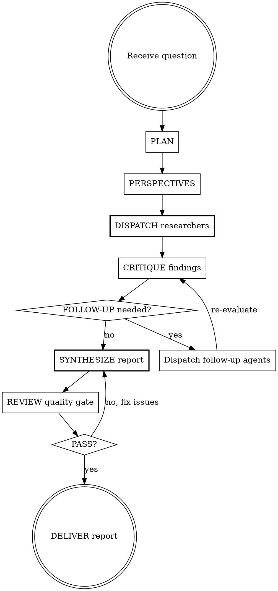

# Deep Research

Multi-agent, multi-perspective, citation-verified research engine. This skill orchestrates the full pipeline: plan, dispatch, critique, synthesize, review.

<EXTREMELY-IMPORTANT>
Follow this workflow exactly. Do not skip steps. Do not combine steps. Do not shortcut the pipeline.
The quality of the final report depends on every phase completing properly.
</EXTREMELY-IMPORTANT>

## Quick Reference



## Configuration Presets

| Preset | Angles | Perspectives | Critic | Follow-up | Use when |
|--------|--------|-------------|--------|-----------|----------|
| **quick** | 2-3 | 2 | skip | skip | Simple factual questions, time-sensitive |
| **standard** | 3-5 | 3 | yes | 1 round | Most research questions (default) |
| **thorough** | 5-7 | 4-5 | yes | up to 2 rounds | Complex, high-stakes, or controversial topics |

Default to **standard** unless the user specifies otherwise or the question clearly warrants quick/thorough.

## The Pipeline

### Phase 1: PLAN

Invoke the **research-planning** skill mentally (do not use the Skill tool — you already know the methodology).

1. Classify the question type: factual, analytical, comparative, exploratory, or predictive
2. Decompose into 3-5 research angles (adjusted by preset)
3. For each angle, determine:
   - The specific sub-question
   - Expected source types (academic, news, government, industry, technical)
   - Complexity estimate (atomic, moderate, deep)
   - Whether web search is required
4. Identify dependencies between angles
5. Identify expected areas of controversy or contradiction

**Output to user**: Present the research plan and ask for confirmation before proceeding. Example:

```
## Research Plan: [topic]

I'll investigate these angles:
1. [angle] — [complexity] — sources: [types]
2. [angle] — [complexity] — sources: [types]
3. [angle] — [complexity] — sources: [types]

Expected controversies: [if any]
Preset: standard (3 perspectives, with critic review)

Proceed?
```

If the user says proceed (or they said "just do it" upfront), continue. Otherwise, adjust.

### Phase 2: PERSPECTIVES

Apply the **multi-perspective** methodology:

1. Generate researcher personas appropriate to the topic (number per preset)
2. Each persona has: role, expertise, viewpoint, what they'd prioritize
3. Assign perspectives to angles — each angle gets at least one perspective, high-controversy angles get multiple

Do not present perspectives to the user unless asked. This is internal methodology.

### Phase 3: DISPATCH Researchers

This is where parallelism happens. For each research angle, spawn one Agent subagent.

**Critical rules for dispatch:**
- Dispatch ALL researcher agents in a SINGLE response (so they run concurrently)
- Each agent gets the `researcher` agent prompt plus:
  - The specific angle and sub-question
  - Their assigned perspective
  - Expected source types
  - Complexity estimate (determines query count)
- Use `subagent_type: "general-purpose"` for each Agent call
- Each agent has access to WebSearch and WebFetch

**Agent prompt template** (paste into each Agent's prompt field):

```
You are a research agent. Follow the researcher methodology below exactly.

RESEARCH ANGLE: [paste the specific angle]
PERSPECTIVE: [paste the assigned perspective — role, viewpoint, priorities]
EXPECTED SOURCES: [paste source types]
COMPLEXITY: [atomic|moderate|deep] — use [3|5|8] search queries accordingly

[Paste the full content of agents/researcher.md here — the methodology section]
```

Wait for all agents to return their findings.

### Phase 4: CRITIQUE

Apply the **adaptive-depth** skill to decide if findings are sufficient, then spawn the critic.

1. Quick check: did all agents return findings? Any failures?
2. Spawn ONE Agent with the `critic` agent prompt
   - Input: all findings from all researchers + the research plan
   - The critic evaluates coverage, finds gaps, detects contradictions, audits sources

3. Read the critic's report. Check the recommendation:
   - **proceed**: Move to synthesis
   - **targeted_followup**: Go to Phase 5
   - **major_revision**: Re-plan and re-dispatch (rare — only if most angles failed)

### Phase 5: FOLLOW-UP (conditional)

If the critic identified CRITICAL gaps:

1. For each CRITICAL issue, spawn a focused follow-up Agent
   - Use the critic's suggested search queries
   - Narrow scope: only address the specific gap
2. Dispatch all follow-up agents in a single response (parallel)
3. After follow-up agents return, re-run the critic on the combined findings
4. Maximum follow-up rounds: 1 for standard, 2 for thorough, 0 for quick

### Phase 6: SYNTHESIZE

Spawn ONE Agent with the `synthesizer` agent prompt.

Input to the synthesizer:
- All findings from all researchers (including follow-ups)
- The critic report
- The original question
- The research plan with perspectives

The synthesizer produces the final report following the report template with:
- Inline citations `[n]` for every factual claim
- Sources appendix with full URLs
- Explicit handling of contradictions
- Honest limitations section

### Phase 7: REVIEW

Apply the **research-review** checklist:

- [ ] Original question is fully answered
- [ ] All planned angles were covered
- [ ] Executive summary accurately reflects findings
- [ ] Every factual claim has citation(s)
- [ ] No `[UNSOURCED]` flags remain
- [ ] Contradictions are explicitly addressed
- [ ] Multiple perspectives are represented
- [ ] Limitations section is honest and specific
- [ ] Sources appendix is complete

**If BLOCK issues found**: Fix them. Re-synthesize the specific sections if needed.
**If only WARN/INFO**: Note them in limitations. Proceed to delivery.

### Phase 8: DELIVER

1. Present the final report to the user in the conversation
2. Optionally write to `reports/` directory if the user wants a file
3. Offer: "Would you like me to go deeper on any section, or investigate any follow-up questions?"

## Structured Finding Format

All inter-agent communication uses this format:

```
## Finding N
**Claim**: [specific, falsifiable assertion]
**Evidence**: [direct quote or precise data from source]
**Source**: [URL] | [title] | [source_type] | [date]
**Confidence**: verified|likely|unverified
**Perspective**: [which perspective]
```

## Red Flags

These thoughts mean STOP — you're about to skip a step:

| Thought | Reality |
|---------|---------|
| "I can answer this without research" | If the user asked for deep research, they want sources. Do the pipeline. |
| "The plan is obvious, skip to dispatch" | Planning prevents wasted agent runs. Take 30 seconds to plan. |
| "The findings look fine, skip the critic" | The critic catches what you miss. Bias blindness is real. |
| "Just one small gap, not worth a follow-up" | If it's CRITICAL, it needs follow-up. That's the threshold. |
| "The report is good enough" | Run the review checklist. Every time. |
| "Citations slow me down" | Unsourced claims are worthless. Citations are non-negotiable. |
| "I'll add citations at the end" | Track citations during synthesis, not after. Retrofitting misses claims. |
| "This question is too simple for the full pipeline" | Use quick preset then. But still follow the pipeline. |

## Common Mistakes

1. **Dispatching agents sequentially** — Always dispatch ALL researchers in one response for parallelism
2. **Vague angle decomposition** — "Look into the economic aspects" is bad. "What is the current market size and 5-year growth projection?" is good.
3. **Skipping perspectives** — Leads to one-sided reports. Even 2 perspectives dramatically improve balance.
4. **Ignoring the critic** — If critic says targeted_followup, do it. Don't rationalize skipping it.
5. **Synthesis by concatenation** — The synthesizer must organize by theme, not by agent. If the report reads like "Agent 1 found... Agent 2 found..." it failed.
6. **Missing the review** — The review catches citation gaps that synthesis misses. Always run it.
